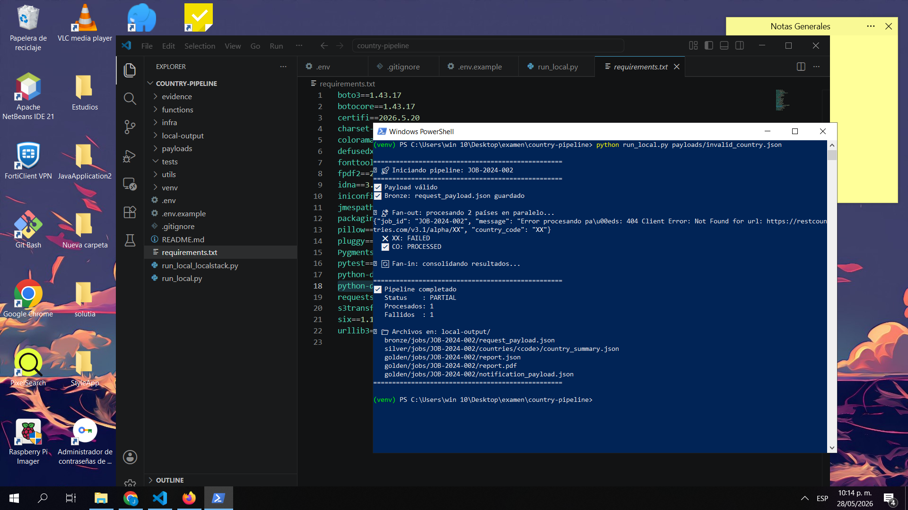
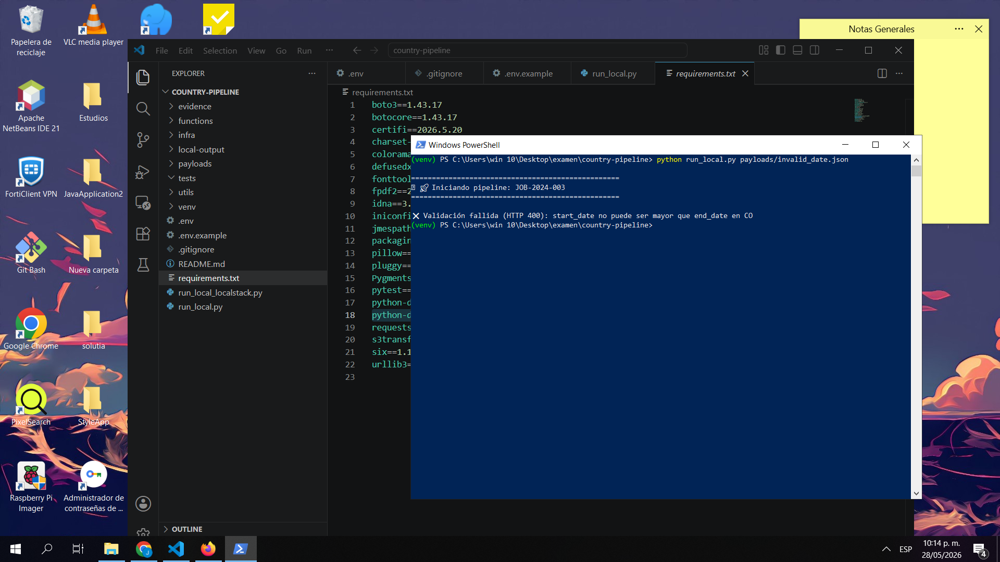
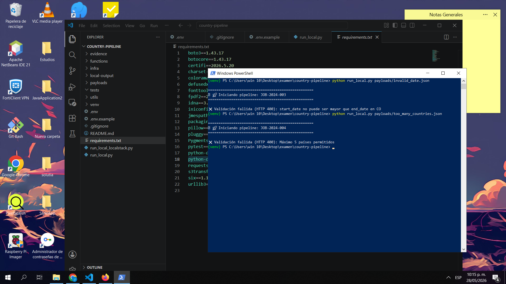
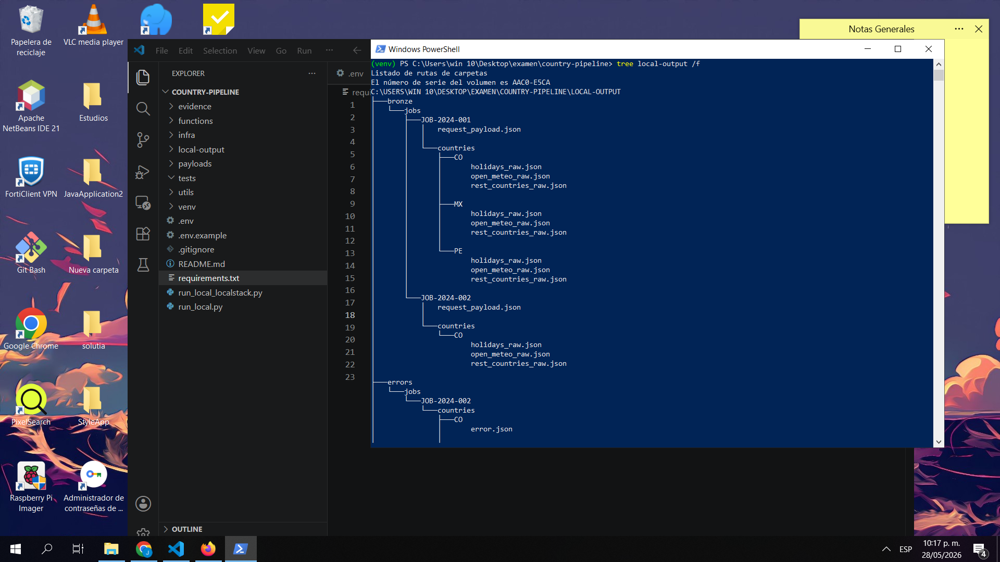

# Serverless Country Intelligence Pipeline

Pipeline serverless para generar reportes de inteligencia por país, construido con Python, AWS Lambda, Step Functions y S3.

## Arquitectura

```
HTTP Request (Lambda Function URL)
        ↓
  Handler Lambda — valida payload, guarda bronze
        ↓
  Step Functions State Machine
        ├── Map State — Fan-out por país (paralelo)
        │     ├── REST Countries API
        │     ├── Open-Meteo API
        │     ├── Nager.Date API
        │     └── Normaliza → S3 Silver
        └── Consolidate Lambda — Fan-in
              └── S3 Golden (report.json + report.pdf)
```

El patrón **fan-out/fan-in** se implementa con el `Map State` de Step Functions, que procesa cada país en paralelo con `MaxConcurrency: 5` y consolida los resultados en una etapa final.

## Servicios AWS utilizados

| Servicio | Motivo |
|---|---|
| Lambda | Ejecución serverless de cada step del pipeline |
| Lambda Function URL | Endpoint HTTP sin API Gateway (costo $0) |
| Step Functions | Orquestación fan-out/fan-in con Map State |
| S3 | Data lake con capas bronze/silver/golden |
| CloudWatch Logs | Observabilidad con job_id y country_code |
| IAM | Permisos mínimos por función |

## Estructura del proyecto

```
country-pipeline/
├── functions/
│   ├── __init__.py
│   ├── handler.py           # Entry point HTTP + validación
│   ├── process_country.py   # Fan-out: consulta APIs + normaliza
│   ├── consolidate.py       # Fan-in: genera reporte golden
│   └── clients/
│       ├── __init__.py
│       ├── rest_countries.py
│       ├── open_meteo.py
│       └── nager.py
├── utils/
│   ├── __init__.py
│   ├── logger.py            # Logger centralizado con job_id/country_code
│   ├── s3_helper.py         # Abstracción de S3
│   └── pdf_generator.py     # Generación de PDF con fpdf2
├── infra/
│   └── template.yaml        # SAM template
├── payloads/
│   ├── happy_path.json
│   ├── invalid_country.json
│   ├── invalid_date.json
│   └── too_many_countries.json
├── .env                     # Variables locales (NO subir a Git)
├── .env.example             # Plantilla de variables (SÍ subir a Git)
├── .gitignore
├── run_local.py             # Script para pruebas locales sin AWS
├── run_server.py            # Servidor HTTP local (simula Lambda Function URL)
├── requirements.txt
└── README.md
```

## Estructura S3

```
s3://<bucket>/
├── bronze/jobs/<job_id>/
│   ├── request_payload.json
│   └── countries/<country_code>/
│       ├── rest_countries_raw.json
│       ├── open_meteo_raw.json
│       └── holidays_raw.json
├── silver/jobs/<job_id>/countries/<country_code>/
│   └── country_summary.json
├── golden/jobs/<job_id>/
│   ├── report.json
│   ├── report.pdf
│   └── notification_payload.json
└── errors/jobs/<job_id>/countries/<country_code>/
    └── error.json
```

## APIs públicas utilizadas

Las siguientes APIs son públicas y no requieren API key ni configuración adicional:

| API | Uso | Endpoint |
|---|---|---|
| REST Countries | Metadatos del país | `https://restcountries.com/v3.1/alpha/{code}` |
| Open-Meteo | Clima histórico | `https://archive-api.open-meteo.com/v1/archive` |
| Nager.Date | Festivos públicos | `https://date.nager.at/api/v3/PublicHolidays/{year}/{code}` |

---

## Ejecución en local (desarrollo)

Las pruebas locales no requieren AWS ni Docker. Todo el pipeline corre en Python puro y los archivos se guardan en `local-output/` replicando la estructura de S3.

### 1. Requisitos previos

- Python 3.11+
- Git

### 2. Clonar e instalar

```bash
git clone <repo-url>
cd country-pipeline

python -m venv venv

# Windows
.\venv\Scripts\activate

# Linux/Mac
source venv/bin/activate

pip install -r requirements.txt
```

### 3. Configurar variables de entorno

Copia `.env.example` como `.env`:

```bash
# Windows
copy .env.example .env

# Linux/Mac
cp .env.example .env
```

Contenido del `.env` para local:

```env
# AWS — Credenciales falsas para pruebas locales
AWS_ACCESS_KEY_ID=test
AWS_SECRET_ACCESS_KEY=test
AWS_DEFAULT_REGION=us-east-1

# S3 — En local los archivos se guardan en local-output/
S3_BUCKET=local-output

# Pipeline
MAX_COUNTRIES=5
LOG_LEVEL=INFO
```

> Las URLs de las APIs públicas van directo en el código porque no tienen API key ni cambian por ambiente.

### 4. Opción A — Script directo

**Caso 1 — Flujo exitoso (3 países válidos)**
```bash
python run_local.py payloads/happy_path.json
```
Resultado esperado:
```
==================================================
🚀 Iniciando pipeline: JOB-2024-001
==================================================
✅ Payload válido
✅ Bronze: request_payload.json guardado
📡 Fan-out: procesando 3 países en paralelo...
  ✅ MX: PROCESSED
  ✅ CO: PROCESSED
  ✅ PE: PROCESSED
🔄 Fan-in: consolidando resultados...
==================================================
✅ Pipeline completado
   Status    : COMPLETED
   Procesados: 3
   Fallidos  : 0
📁 Archivos en: local-output/
   bronze/jobs/JOB-2024-001/request_payload.json
   silver/jobs/JOB-2024-001/countries/<code>/country_summary.json
   golden/jobs/JOB-2024-001/report.json
   golden/jobs/JOB-2024-001/report.pdf
   golden/jobs/JOB-2024-001/notification_payload.json
==================================================
```

**Caso 2 — País inválido (status PARTIAL)**
```bash
python run_local.py payloads/invalid_country.json
```
Resultado esperado:
```
📡 Fan-out: procesando 2 países en paralelo...
  ❌ XX: FAILED
  ✅ CO: PROCESSED
✅ Pipeline completado
   Status    : PARTIAL
   Procesados: 1
   Fallidos  : 1
```

**Caso 3 — Fecha inválida (HTTP 400)**
```bash
python run_local.py payloads/invalid_date.json
```
Resultado esperado:
```
❌ Validación fallida (HTTP 400): start_date no puede ser mayor que end_date en CO
```

**Caso 4 — Más de 5 países (HTTP 400)**
```bash
python run_local.py payloads/too_many_countries.json
```
Resultado esperado:
```
❌ Validación fallida (HTTP 400): Máximo 5 países permitidos
```

### 5. Opción B — Servidor HTTP local (simula Lambda Function URL)

Levanta el servidor en una ventana de PowerShell:

```bash
python run_server.py
# 🚀 Servidor corriendo en http://localhost:8000
```

En otra ventana prueba con curl:

**Caso 1 — Flujo exitoso**
```bash
# Windows PowerShell
curl -X POST http://localhost:8000 `
  -H "Content-Type: application/json" `
  -d (Get-Content payloads/happy_path.json -Raw)

# Linux/Mac
curl -X POST http://localhost:8000 \
  -H "Content-Type: application/json" \
  -d @payloads/happy_path.json
```
Respuesta esperada `HTTP 202`:
```json
{
  "job_id": "JOB-2024-001",
  "status": "COMPLETED",
  "message": "Pipeline completado"
}
```

**Caso 2 — País inválido**
```bash
# Windows PowerShell
curl -X POST http://localhost:8000 `
  -H "Content-Type: application/json" `
  -d (Get-Content payloads/invalid_country.json -Raw)
```
Respuesta esperada `HTTP 202`:
```json
{
  "job_id": "JOB-2024-002",
  "status": "PARTIAL",
  "message": "Pipeline completado"
}
```

**Caso 3 — Fecha inválida**
```bash
# Windows PowerShell
curl -X POST http://localhost:8000 `
  -H "Content-Type: application/json" `
  -d (Get-Content payloads/invalid_date.json -Raw)
```
Respuesta esperada `HTTP 400`:
```json
{
  "error": "start_date no puede ser mayor que end_date en CO"
}
```

**Caso 4 — Más de 5 países**
```bash
# Windows PowerShell
curl -X POST http://localhost:8000 `
  -H "Content-Type: application/json" `
  -d (Get-Content payloads/too_many_countries.json -Raw)
```
Respuesta esperada `HTTP 400`:
```json
{
  "error": "Máximo 5 países permitidos"
}
```

### 6. Revisar archivos generados localmente

```bash
# Windows
dir local-output\ /s

# Linux/Mac
find local-output/ -type f
```

Archivos generados:
```
local-output/
├── bronze/jobs/JOB-2024-001/
│   ├── request_payload.json
│   └── countries/
│       ├── CO/rest_countries_raw.json
│       ├── CO/open_meteo_raw.json
│       ├── CO/holidays_raw.json
│       ├── PE/  (misma estructura)
│       └── MX/  (misma estructura)
├── silver/jobs/JOB-2024-001/
│   └── countries/
│       ├── CO/country_summary.json
│       ├── PE/country_summary.json
│       └── MX/country_summary.json
└── golden/jobs/JOB-2024-001/
    ├── report.json
    ├── report.pdf
    └── notification_payload.json
```

---

## Ejecución en AWS

### 1. Requisitos previos

- AWS CLI configurado con credenciales reales
- AWS SAM CLI instalado
- Docker instalado (para SAM build)
- Python 3.11+

### 2. Configurar credenciales AWS

```bash
aws configure
# AWS Access Key ID: <tu-key-real>
# AWS Secret Access Key: <tu-secret-real>
# Default region name: us-east-1
# Default output format: json
```

Verifica acceso:
```bash
aws sts get-caller-identity
```

### 3. Configurar variables de entorno para AWS

Actualiza el `.env` con valores reales:

```env
# AWS — Credenciales reales
AWS_ACCESS_KEY_ID=<tu-access-key-real>
AWS_SECRET_ACCESS_KEY=<tu-secret-key-real>
AWS_DEFAULT_REGION=us-east-1

# S3 — Bucket real (se crea automáticamente con SAM)
S3_BUCKET=country-pipeline-prod-<account-id>

# Step Functions — Se obtiene después del deploy
STATE_MACHINE_ARN=arn:aws:states:us-east-1:<account-id>:stateMachine:country-pipeline-state-machine

MAX_COUNTRIES=5
LOG_LEVEL=INFO
```

### 4. Build

```bash
cd infra
sam build --template template.yaml
```

### 5. Deploy primera vez

```bash
sam deploy --guided \
  --stack-name country-pipeline \
  --capabilities CAPABILITY_IAM
```

SAM te pregunta:
```
Stack Name [country-pipeline]: country-pipeline
AWS Region [us-east-1]: us-east-1
Confirm changes before deploy [y/N]: y
Allow SAM CLI IAM role creation [Y/n]: Y
Save arguments to configuration file [Y/n]: Y
```

### 6. Deploy siguientes veces

```bash
sam deploy --stack-name country-pipeline
```

### 7. Obtener URL del endpoint

```bash
aws cloudformation describe-stacks \
  --stack-name country-pipeline \
  --query "Stacks[0].Outputs[?OutputKey=='HandlerFunctionUrl'].OutputValue" \
  --output text
```

### 8. Invocar el endpoint en AWS

**Caso 1 — Flujo exitoso**
```bash
curl -X POST <FUNCTION_URL> \
  -H "Content-Type: application/json" \
  -d @payloads/happy_path.json
```

**Caso 2 — País inválido**
```bash
curl -X POST <FUNCTION_URL> \
  -H "Content-Type: application/json" \
  -d @payloads/invalid_country.json
```

**Caso 3 — Fecha inválida**
```bash
curl -X POST <FUNCTION_URL> \
  -H "Content-Type: application/json" \
  -d @payloads/invalid_date.json
```

**Caso 4 — Más de 5 países**
```bash
curl -X POST <FUNCTION_URL> \
  -H "Content-Type: application/json" \
  -d @payloads/too_many_countries.json
```

### 9. Revisar resultados en S3

```bash
# Listar archivos generados
aws s3 ls s3://<bucket>/bronze/jobs/JOB-2024-001/ --recursive
aws s3 ls s3://<bucket>/silver/jobs/JOB-2024-001/ --recursive
aws s3 ls s3://<bucket>/golden/jobs/JOB-2024-001/ --recursive

# Descargar reporte
aws s3 cp s3://<bucket>/golden/jobs/JOB-2024-001/report.json .
aws s3 cp s3://<bucket>/golden/jobs/JOB-2024-001/report.pdf .
```

### 10. Revisar logs en CloudWatch

```bash
# Logs del handler
aws logs tail /aws/lambda/country-pipeline-handler --follow

# Logs de process_country
aws logs tail /aws/lambda/country-pipeline-process --follow

# Logs de consolidate
aws logs tail /aws/lambda/country-pipeline-consolidate --follow

# Filtrar por job_id específico
aws logs filter-log-events \
  --log-group-name /aws/lambda/country-pipeline-process \
  --filter-pattern "JOB-2024-001"

# Filtrar por country_code
aws logs filter-log-events \
  --log-group-name /aws/lambda/country-pipeline-process \
  --filter-pattern "CO"
```

### 11. Revisar ejecución en Step Functions

```bash
# Listar ejecuciones
aws stepfunctions list-executions \
  --state-machine-arn <STATE_MACHINE_ARN>

# Ver detalle de una ejecución
aws stepfunctions describe-execution \
  --execution-arn <EXECUTION_ARN>
```

---

## Limpieza de recursos

```bash
# 1. Vaciar el bucket S3 (requerido antes de eliminar el stack)
aws s3 rm s3://<bucket> --recursive

# 2. Eliminar stack completo (Lambda, Step Functions, S3, IAM, CloudWatch)
aws cloudformation delete-stack --stack-name country-pipeline

# 3. Verificar que se eliminó
aws cloudformation describe-stacks --stack-name country-pipeline
# Debe retornar error: "Stack with id country-pipeline does not exist"

# 4. Eliminar bucket si quedó
aws s3 rb s3://<bucket> --force
```

---

## Manejo de errores

| Caso | Comportamiento |
|---|---|
| Payload inválido | HTTP 400, pipeline no inicia |
| País inválido (XX) | Status `PARTIAL`, error guardado en `errors/` |
| API externa falla | País marcado como `FAILED`, job continúa |
| Todos los países fallan | Status `FAILED` |
| Más de 5 países | HTTP 400, pipeline no inicia |
| start_date > end_date | HTTP 400, pipeline no inicia |

Los errores siempre incluyen `job_id` y `country_code` en logs de CloudWatch.

---

## Costo esperado: USD 0

| Servicio | Tier gratuito |
|---|---|
| Lambda | 1M requests/mes gratis |
| Step Functions | 4000 transiciones de estado/mes gratis |
| S3 | 5GB almacenamiento gratis |
| CloudWatch | 5GB logs gratis |
| Function URL | Incluida con Lambda, sin costo adicional |

---

## Adaptación a AWS Step Functions

La solución ya usa Step Functions como orquestador principal. El `Map State` implementa el fan-out/fan-in nativo:

```
StateMachine
├── FanOut (Map State)
│   ├── MaxConcurrency: 5
│   ├── Iterator → ProcessCountry (Task State → Lambda)
│   └── Catch → HandleCountryError (Pass State)
└── FanIn (Task State → Consolidate Lambda)
```

| Step | Tipo | Archivo |
|---|---|---|
| Validar payload | Handler Lambda | `functions/handler.py` |
| Guardar bronze | Dentro de Handler | `utils/s3_helper.py` |
| Fan-out por país | Map State | Step Functions |
| Consultar APIs | Task State | `functions/process_country.py` |
| Normalizar silver | Task State | `functions/process_country.py` |
| Fan-in consolidar | Task State | `functions/consolidate.py` |
| Generar golden | Dentro de Consolidate | `utils/pdf_generator.py` |

Para producción se separarían las 3 llamadas a APIs en Lambdas independientes conectadas con un `Parallel State`.

---

## Qué cambiaría para producción

- Separar cada cliente de API en su propia Lambda
- Agregar autenticación en la Function URL (`AuthType: AWS_IAM`)
- Usar SQS entre el handler y Step Functions para desacoplar
- Agregar X-Ray para trazabilidad distribuida
- Configurar alarmas en CloudWatch para errores críticos
- Usar S3 Lifecycle policies para archivar datos antiguos
- Agregar reintentos con backoff exponencial en cada cliente de API
- Secrets Manager para credenciales si se añaden APIs con key
- Separar entornos dev/staging/prod con stacks independientes
- Pipeline CI/CD con GitHub Actions para deploy automático

---

## Nota sobre Lambda Durable Functions vs Step Functions

La prueba menciona "Lambda Durable Functions" como orquestador.
Este servicio no existe de forma nativa en AWS. El equivalente
real y más cercano es **AWS Step Functions**, que es exactamente
lo que esta solución implementa.

El `Map State` de Step Functions es el equivalente directo a las
operaciones Map/Parallel/Step mencionadas en la prueba:

| Concepto prueba | Implementación real |
|---|---|
| Lambda Durable Functions | AWS Step Functions |
| Map | Map State (fan-out por país) |
| Parallel | Parallel State (APIs independientes) |
| Step | Task State (cada Lambda) |

La arquitectura está diseñada de forma modular y desacoplada,
por lo que cada step puede mapearse directamente a un estado
de Step Functions sin modificar el código Python — solo
cambiando la definición del State Machine en el SAM template.

---

## Orquestación con Step Functions — Detalle de implementación

El State Machine tiene los siguientes estados definidos en `infra/template.yaml`:

**FanOut (Map State)**
- Itera sobre la lista de países del payload
- Procesa hasta 5 países en paralelo (`MaxConcurrency: 5`)
- Cada país pasa por `ProcessCountry Lambda`
- Si un país falla, `HandleCountryError` lo captura sin detener el job completo

**FanIn (Task State)**
- Recibe todos los resultados del Map State
- Consolida el silver de cada país en un golden final
- Genera `report.json`, `report.pdf` y `notification_payload.json`

Diagrama de estados:

```
StartAt: FanOut
    │
    ▼
FanOut (Map State) ──────────────────────────────┐
    │  Por cada país en paralelo:                 │
    │  ┌──────────────────────────┐               │
    │  │ ProcessCountry           │  Error ──────►│ HandleCountryError
    │  │ (Task State)             │               │ (Pass State)
    │  │  - Consulta REST Countries│               │
    │  │  - Consulta Open-Meteo   │               │
    │  │  - Consulta Nager.Date   │               │
    │  │  - Guarda Bronze         │               │
    │  │  - Normaliza → Silver    │               │
    │  └──────────────────────────┘               │
    └────────────────────────────────────────────┘
    │
    ▼
FanIn (Task State)
    │  - Consolida todos los silver por país
    │  - Genera report.json en golden
    │  - Genera report.pdf en golden
    │  - Genera notification_payload.json en golden
    ▼
   END
```

Cada Lambda del pipeline es completamente independiente y se comunica
solo a través de S3 y el payload de Step Functions — lo que garantiza
que el diseño es modular, reutilizable y adaptable.

---

## Evidencia de ejecución

Las siguientes capturas muestran los 4 casos de prueba ejecutados localmente sin AWS.

### Caso 1 — Flujo exitoso (3 países válidos)


### Caso 2 — País inválido (status PARTIAL)


### Caso 3 — Fecha inválida (HTTP 400)


### Caso 4 — Más de 5 países (HTTP 400)


### Archivos generados en local-output/
